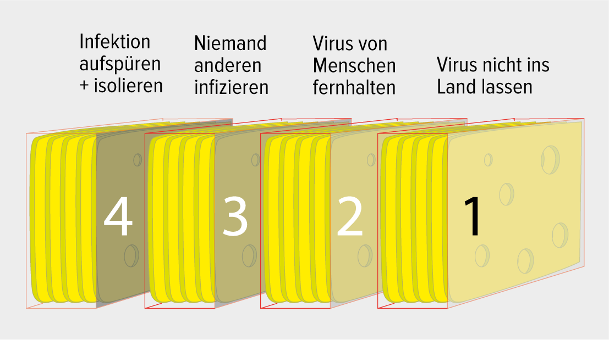

<h2>Umfassende Pandemiestrategie</h2>
Basierend auf dem «Swiss Cheese Modell» (Reason 2000) wird ein System mit zwei Ebenen und einem darübergelegten Ampelsystem gebildet. Vier übergeordnete Module bilden die Hauptgliederungsebene. Jedes dieser Module enthält eine unterschiedliche Anzahl von weiteren Komponenten («Käsescheiben»). Jede dieser Komponenten entspricht einer Massnahme, mit der eine Eingrenzung der Pandemie erzielt werden soll.

Die übergeordneten 

Literatur
Reason J. Human error: models and management. BMJ. 2000; 320: 768–770
